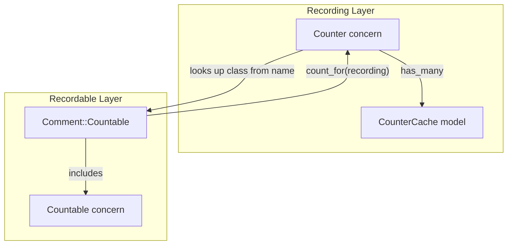

# Article Comment Counts (Revised)

## Key Design Change

The **countable is the counted type** (Comment), not the container (Article). This follows the existing Searchable/Searcher pattern more closely:

- `Countable` concern (general) on recordables — `countable?` returns `false` by default
- `Comment::Countable` (specialized) — returns `true` for `countable?` and implements `count_for(recording)`
- `Counter` concern on Recording — provides infrastructure

## Architecture



## Files to Create/Modify

### 1) Migration + Model

Create [db/migrate/xxx_create_counter_caches.rb](db/migrate/20260120084925_create_counter_caches.rb) and [app/models/counter_cache.rb](app/models/counter_cache.rb):

```ruby
# Migration
create_table :counter_caches do |t|
  t.references :counterable, polymorphic: true, null: false
  t.string :name, null: false
  t.integer :count, null: false, default: 0
end
add_index :counter_caches, [:counterable_type, :counterable_id, :name], unique: true, name: "index_counter_caches_uniqueness"

# Model
class CounterCache < ApplicationRecord
  belongs_to :counterable, polymorphic: true
end
```

### 2) Countable Concern (General)

Create [app/models/concerns/countable.rb](app/models/concerns/countable.rb):

```ruby
module Countable
  extend ActiveSupport::Concern

  def countable?
    false
  end

  class_methods do
    def counter_name
      model_name.plural  # "comments" for Comment
    end

    def count_for(recording)
      raise NotImplementedError, "#{name} must implement .count_for(recording)"
    end
  end
end
```

### 3) Comment::Countable (Specialized)

Create [app/models/comment/countable.rb](app/models/comment/countable.rb):

```ruby
module Comment::Countable
  extend ActiveSupport::Concern
  include ::Countable

  def countable?
    true
  end

  class_methods do
    def count_for(recording)
      recording.children.where(recordable_type: "Comment").count
    end
  end
end
```

### 4) Counter Concern (on Recording)

Create [app/models/concerns/counter.rb](app/models/concerns/counter.rb):

```ruby
module Counter
  extend ActiveSupport::Concern

  included do
    has_many :counter_caches, as: :counterable, dependent: :destroy

    after_create :refresh_parent_counter
    after_destroy :refresh_parent_counter
  end

  def counter(name)
    counter_caches.find_by(name: name.to_s)&.count
  end

  def refresh_counter!(name)
    klass = name.to_s.classify.constantize
    return unless klass.new.countable?

    value = klass.count_for(self)
    cache = counter_caches.find_or_initialize_by(name: name.to_s)
    cache.update!(count: value)
  end

  private

  def refresh_parent_counter
    return unless parent && recordable.countable?

    parent.refresh_counter!(recordable.class.counter_name)
  end
end
```

When a countable recording (e.g., Comment) is created or destroyed, it automatically refreshes the parent's counter using the countable's `counter_name`.

### 5) Wire Up Concerns

- [app/models/concerns/recordable.rb](app/models/concerns/recordable.rb) — add `include Countable`
- [app/models/comment.rb](app/models/comment.rb) — add `include Countable` (resolves to `Comment::Countable`)
- [app/models/recording.rb](app/models/recording.rb) — add `include Counter`

### 6) Tests

Create [test/models/concerns/counter_test.rb](test/models/concerns/counter_test.rb):

- Test `countable?` returns false by default, true for Comment
- Test `Comment.counter_name` returns "comments"
- Test `Comment.count_for(recording)` counts direct children
- Test `recording.refresh_counter!(:comments)` persists correct count
- Test `recording.counter(:comments)` reads cached value
- Test counter is automatically incremented when comment is created
- Test counter is automatically decremented when comment is destroyed

## Usage

```ruby
# Counter is automatically refreshed when comments are added/removed
article_recording.children.create!(recordable: Comment.new(body: "Hello"))
# => parent's :comments counter is refreshed automatically

# Read the cached value
article_recording.counter(:comments)  # => 1

# Manual refresh if needed
article_recording.refresh_counter!(:comments)
```