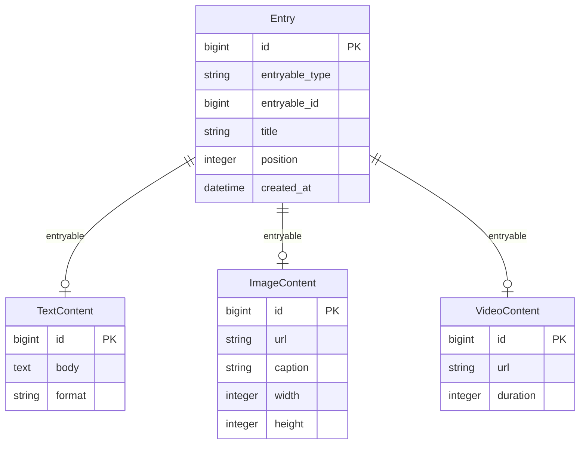
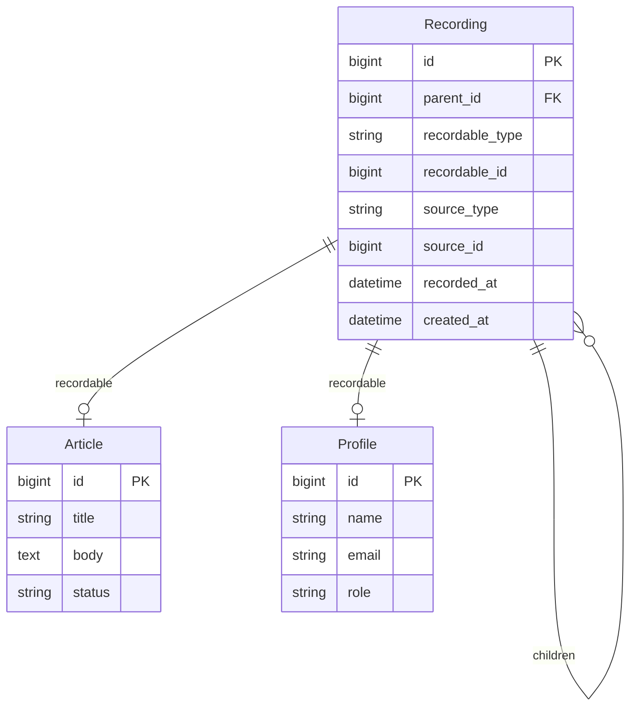
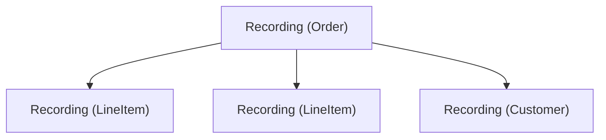
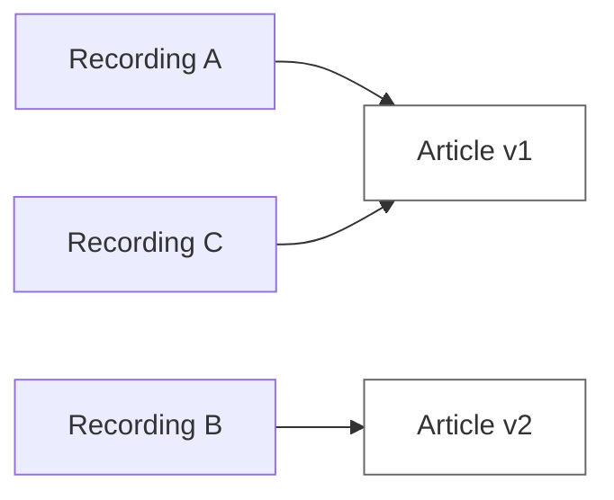
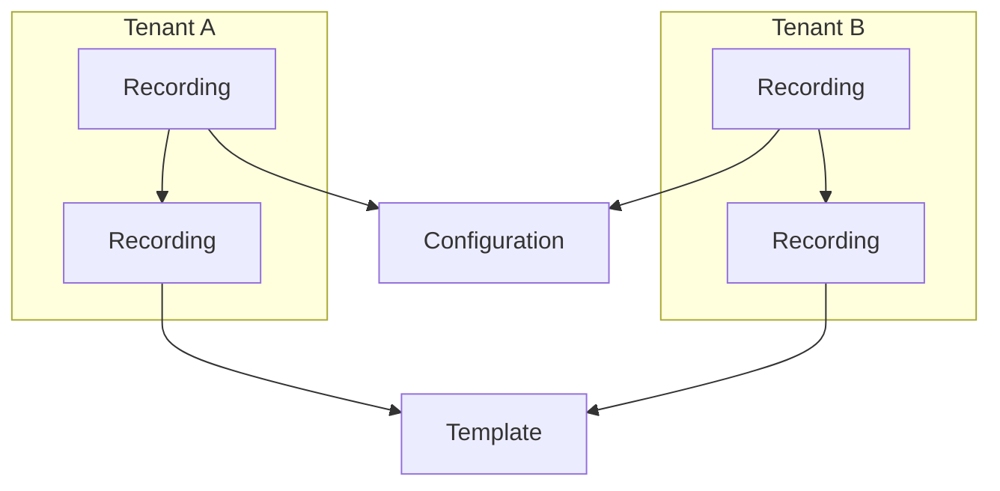
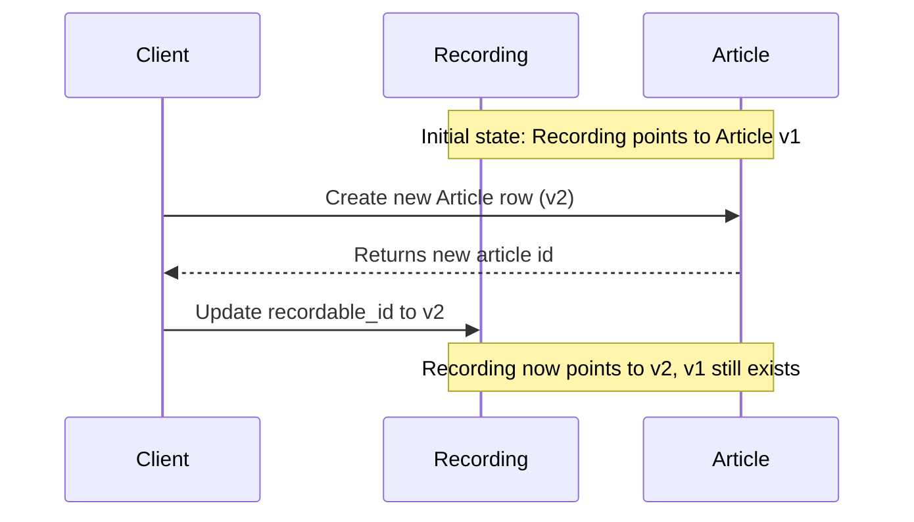
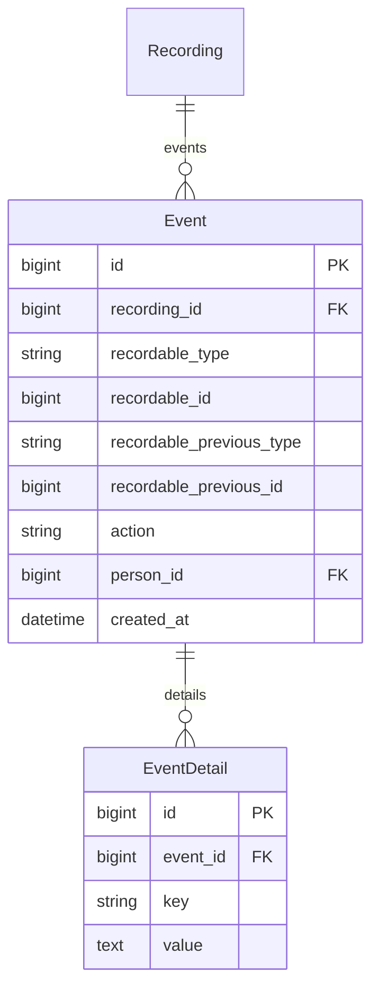
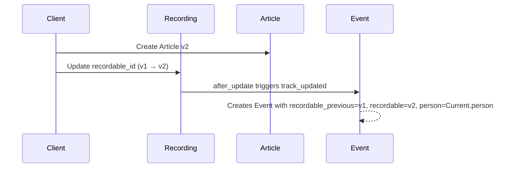
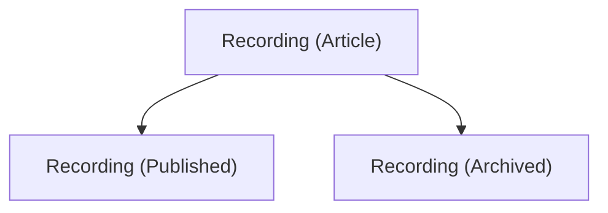
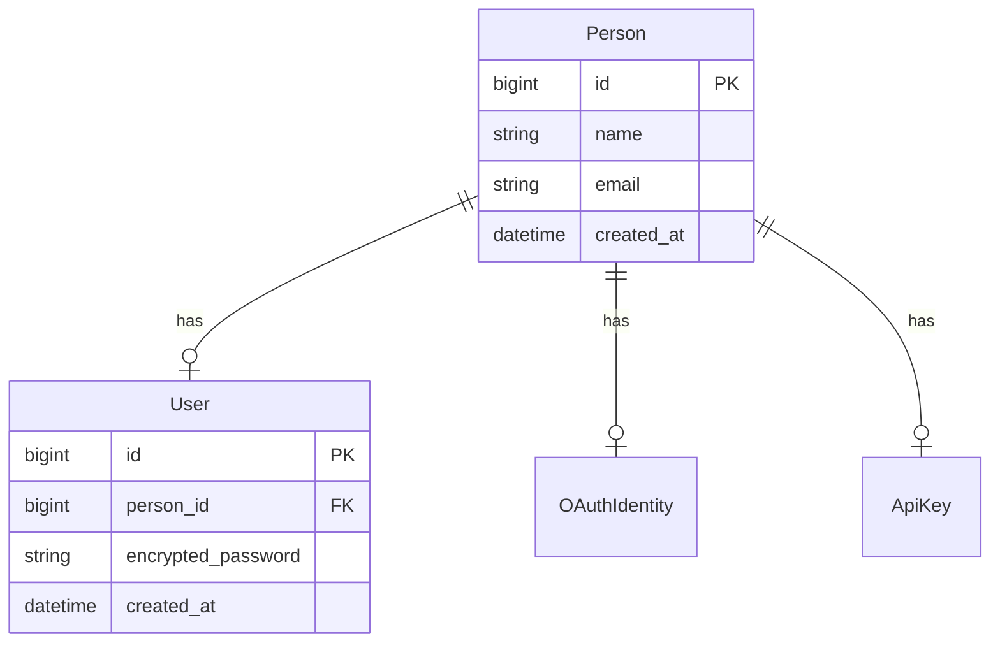

# Generic Rails Architecture Guidelines

## Overview

Create a set of standalone markdown documents in `docs/guidelines/` containing portable Rails patterns:

- **models.md** - Delegated type pattern (general concept), Recording/Recordable pattern (delegated type implementation for immutable versioning), Person model pattern, modeling rules
- **concerns.md** - Concern organization, namespacing, what belongs where
- **views.md** - View guidelines (placeholder for future content)
- **controllers.md** - Controller namespacing, state recordable patterns

All documents will use generic domain examples so they can be applied to any Rails project.

---

## Document Structure

All content below will be organized into the appropriate guideline files.

---

## models.md Content

### 1. Delegated Type Pattern

Rails `delegated_type` provides single-table inheritance with separate tables for each type. This is a foundational pattern used throughout the application.

**Core Concept:**

Instead of storing all data in one polymorphic table, `delegated_type` uses:

- **Delegator table** - stores the polymorphic reference and shared attributes
- **Delegate tables** - store type-specific data



**Benefits:**

- **Type-specific attributes** - each delegate has only its relevant fields
- **Type-specific behavior** - delegates can have their own methods and concerns
- **Cleaner queries** - filter by type without complex conditionals
- **Better schema** - no NULL-heavy columns for attributes that only apply to some types

**Example Implementation:**

```ruby
# app/models/entry.rb (delegator)
class Entry < ApplicationRecord
  delegated_type :entryable, types: %w[TextContent ImageContent VideoContent]

  # Shared attributes: title, position
  # Delegates to entryable for type-specific data
end

# app/models/text_content.rb (delegate)
class TextContent < ApplicationRecord
  has_one :entry, as: :entryable, touch: true
end

# app/models/image_content.rb (delegate)
class ImageContent < ApplicationRecord
  has_one :entry, as: :entryable, touch: true

  def aspect_ratio
    width.to_f / height
  end
end
```

**Usage:**

```ruby
# Creating
entry = Entry.create!(
  title: "Introduction",
  position: 1,
  entryable: TextContent.create!(body: "Hello world", format: "markdown")
)

# Accessing
entry.entryable          # => #<TextContent>
entry.entryable.body     # => "Hello world"
entry.entryable_type     # => "TextContent"

# Querying
Entry.text_contents      # scope for entries with TextContent
Entry.where(entryable_type: 'ImageContent')
```

**Migration Pattern:**

```ruby
# Delegator table
create_table :entries do |t|
  t.string :entryable_type, null: false
  t.bigint :entryable_id, null: false
  t.string :title
  t.integer :position
  t.timestamps
end

add_index :entries, [:entryable_type, :entryable_id], unique: true

# Delegate tables
create_table :text_contents do |t|
  t.text :body
  t.string :format
  t.timestamps
end
```

**When to Use Delegated Types:**

| Use Delegated Type | Use Single Table | Use Separate Tables |

|-------------------|------------------|---------------------|

| Multiple types with type-specific attributes | Few types, similar attributes | Completely different models |

| Need type-specific behavior | Mostly shared behavior | No shared behavior |

| Types can share some attributes | All types need all fields | No shared fields |

| Want cleaner schema | Prefer simplicity | Complete separation |

---

### 2. Recording/Recordable Pattern (Delegated Type Implementation)

**Recording/Recordable is a specific implementation of the delegated type pattern for immutable versioning.**

The pattern uses Rails' `delegated_type` feature where:

- **Recording** is the delegator (polymorphic table with `delegated_type :recordable`)
- **Recordables** (Article, Profile, etc.) are the delegates (type-specific immutable data tables)

This follows the same delegated type architecture described in Section 1, but with immutability constraints and versioning semantics.

**Architecture Diagram:**



**Delegated Type Implementation:**

```ruby
# app/models/recording.rb (delegator)
class Recording < ApplicationRecord
  delegated_type :recordable, types: %w[Article Profile Order LineItem]

  belongs_to :parent, class_name: 'Recording', optional: true
  has_many :children, class_name: 'Recording', foreign_key: :parent_id

  # Delegates to recordable for type-specific immutable data
end

# app/models/article.rb (delegate)
class Article < ApplicationRecord
  include Recordable  # enforces immutability

  has_one :recording, as: :recordable, touch: true
end

# app/models/profile.rb (delegate)
class Profile < ApplicationRecord
  include Recordable  # enforces immutability

  has_one :recording, as: :recordable, touch: true
end
```

**Tree Structure:**

Recordings form a tree hierarchy via `parent_id`:

- A root recording has `parent_id: nil`
- Child recordings reference their parent via `parent_id`
- Enables capturing related snapshots together (e.g., a post and its comments as a single versioned unit)



**Immutability Model:**

- **Recordables are immutable** - no updates, no deletes allowed
- **Recordings are mutable pointers** - can be updated to point to different recordables
- Updates are performed by creating a new recordable row, then updating the Recording's `recordable_id`
- Old recordables remain in the database, creating an append-only history

**Shared Recordables:**

Because recordables are immutable, **multiple recordings can safely point to the same recordable**. This is a key architectural benefit:

- **Storage efficiency** - identical data is stored once, referenced many times
- **Deduplication** - when creating a new recording, check if an identical recordable already exists
- **Safe sharing** - no risk of one recording's changes affecting another since recordables never change



In this example, Recording A and Recording C both point to the same Article v1 - this is safe and intentional.

**Multi-Tenant Benefits:**

The combination of safe sharing and tree structure provides powerful capabilities for multi-tenant systems:

- **Fast tenant provisioning** - setting up a new account only requires creating new Recording records; the underlying recordable data is shared
- **Easy duplication** - duplicate entire object trees by creating new Recording hierarchies pointing to the same recordables
- **Template systems** - a "template" can be a tree of recordings; instantiating it for a new tenant just clones the recording structure
- **Storage efficient** - tenants sharing common data (e.g., default configurations, templates) don't duplicate the underlying recordables



Both tenants have their own recording trees, but share the same underlying Configuration and Template recordables.



**Event Tracking (Eventable Concern):**

Recordings include an `Eventable` concern that automatically tracks what happens to them. Developers don't need to manually create events - tracking is handled via callbacks.



- **`Event`** - tracks actions on recordings
  - `action` - what happened: `'created'`, `'updated'`
  - `recording_id` - the recording this event is for
  - `recordable_type/id` - the current recordable at time of event
  - `recordable_previous_type/id` - for updates, the recordable before the change
  - `person_id` - who performed the action (via `Current.person`)

- **`Event::Detail`** - stores additional context as key/value pairs
  - Flexible storage for action-specific data
  - Keeps the Event model lean

- **Automatic tracking via `Recording::Eventable` concern:**
  - `track_created` - triggered by `after_create` callback
  - `track_updated` - triggered by `after_update` callback
  - Tracks `Current.person` - who performed the action
  - Developers include the concern and tracking happens automatically
```ruby
# app/models/recording/eventable.rb
module Recording::Eventable
  extend ActiveSupport::Concern

  included do
    has_many :events, as: :recording, dependent: :destroy

    after_create :track_created
    after_update :track_updated
  end

  def track_created
    track_event(:created)
  end

  def track_updated
    track_event(:updated)
  end

  def track_event(action, recordable_previous: nil, **particulars)
    Event.create!(
      recording: self,
      recordable: recordable,
      recordable_previous: recordable_previous,
      action: action,
      person: Current.person,
      detail: Event::Detail.new(particulars)
    )
  end
end
```



**Modeling Rules - State as Recordables:**

A key principle: **represent state changes as recordables in the tree, not as fields on the parent model**.

**Traditional (avoid):**

```ruby
# Adding fields to the model
class Article < ApplicationRecord
  # published_at :datetime
  # published_by_id :bigint
  # archived_at :datetime
  # archived_by_id :bigint
end
```

**Recording Pattern (preferred):**


```ruby
# app/models/article/published.rb
# State recordable namespaced under the parent model
class Article::Published < ApplicationRecord
  include Recordable
  # minimal or empty - existence is the state
end

# app/models/article/archived.rb
class Article::Archived < ApplicationRecord
  include Recordable
  # can include reason, notes, etc. (e.g., reason text)
end
```

**No Timestamps on Recordables:**

Recordable models do not need `created_at` and `updated_at` columns. Since recordables are immutable:

- `created_at` is captured via the Event when the recording is created
- `updated_at` is never needed (recordables cannot be updated)
```ruby
# Migration for a recordable - no timestamps
class CreateArticlePublished < ActiveRecord::Migration[7.1]
  def change
    create_table :article_publisheds do |t|
      # No t.timestamps - event tracking handles this
    end
  end
end
```


**Namespacing Rule:**

If a state recordable is specific to one model, namespace it under that model:

```
app/models/
├── article/
│   ├── published.rb          # Article::Published
│   ├── archived.rb           # Article::Archived
│   └── featured.rb           # Article::Featured
├── article.rb
└── concerns/
    └── recordable.rb
```

If a state recordable is shared across multiple models, place it at the top level - do not use a shared namespace.

```
app/models/
├── article/
│   ├── published.rb          # Article::Published (article-specific)
│   └── featured.rb           # Article::Featured (article-specific)
├── article.rb
├── comment/
│   └── flagged.rb            # Comment::Flagged (comment-specific)
├── comment.rb
├── archived.rb               # Archived (shared - top level, no namespace)
└── concerns/
    └── recordable.rb
```

**Benefits:**

- **Existence is state** - presence of a Published recording means "published"; absence means "not published"
- **Who/when for free** - event tracking automatically captures who published and when
- **Reversible states** - to "unpublish", remove or nullify the Published recording
- **Rich state data** - the recordable can hold state-specific data (e.g., archive reason)
- **State history** - events track all state transitions automatically
- **No field bloat** - parent model stays clean; states live in the tree

**Querying State:**

```ruby
# Check if published
article_recording.children.exists?(recordable_type: 'Published')

# Or with a scope/method
class Recording
  def published?
    children.exists?(recordable_type: 'Published')
  end

  def published_recording
    children.find_by(recordable_type: 'Published')
  end
end
```

**When to use fields vs recordables:**

| Use Fields | Use Recordables |

|------------|-----------------|

| Intrinsic attributes (title, body) | State transitions (published, archived) |

| Rarely changes | Tracks who/when |

| No audit trail needed | Needs history |

| Simple values | May need additional state data |

**Key concepts to document:**

- Delegated type pattern (general Rails concept)
- When to use delegated types vs alternatives
- **Recording/Recordable as a delegated type implementation:**
  - `Recording` as the delegator using `delegated_type`
  - Recordables as the delegates (immutable data - append-only)
- Update mechanism: create new recordable, re-point recording
- Tree structure via `parent_id` for hierarchical recordings
- State changes as child recordables, not fields
- `Recordable` concern enforcing immutability
- `Recording::Eventable` concern for automatic event tracking
- `Event` model with action, recording, recordable, and previous_recordable references
- `Event::Detail` model for flexible additional context
- Migration templates for delegators and delegates

---

### 3. Person Model Pattern

The `Person` model represents identity, separate from authentication. This is a foundational architectural pattern.

**Core Principle:**

- **Person** = who someone is (identity)
- **User** = how someone authenticates (credentials)



**Key Rules:**

- **Ownership belongs to Person, not User** - all record ownership (e.g., `created_by`, `owned_by`) references Person
- **Current.person is set on sign-in** - when a User authenticates, set `Current.person = user.person`
- **User accounts relate to Person** - `User belongs_to :person`, not the reverse
- **Person survives User deletion** - if a user account is deleted, the Person and all their associated data remains intact

**Benefits:**

- **Data preservation** - deleting a user account doesn't orphan or require cleanup of existing records
- **Multiple auth mechanisms** - add OAuth, API keys, SSO without impacting existing code that references Person
- **Clean audit trails** - events and ownership consistently reference Person regardless of how they authenticated
- **Future flexibility** - a Person could have multiple User accounts, or authenticate via different methods over time

**Setting Current.person:**

```ruby
# In your authentication flow (e.g., ApplicationController)
class ApplicationController < ActionController::Base
  before_action :set_current_person

  private

  def set_current_person
    Current.person = current_user&.person
  end
end
```
```ruby
# app/models/current.rb
class Current < ActiveSupport::CurrentAttributes
  attribute :person
end
```

---

## concerns.md Content

### 1. Model Organization with Concerns

**Directory structure:**

```
app/models/
├── concerns/                    # Shared concerns (2+ models)
│   ├── recordable.rb
│   └── sluggable.rb
├── post/                        # Post-specific concerns
│   ├── publishing.rb            # Post::Publishing
│   └── moderation.rb            # Post::Moderation
├── user/                        # User-specific concerns
│   ├── authentication.rb        # User::Authentication
│   └── authorization.rb         # User::Authorization
├── post.rb
└── user.rb
```

### 2. Specializing General Concerns

When a model needs to specialize behavior from a general concern, namespace the specialization under the model. This leverages Ruby's constant lookup to create a clean inheritance chain.

**Pattern:**

1. **General concern** lives in `app/models/concerns/`
2. **Specialized concern** lives under the model namespace in `app/models/model_name/`
3. **Model includes** the concern name without namespace
4. **Ruby resolves** to the namespaced version first
5. **Specialized concern includes** the general version with `::` prefix

**Example Structure:**

```
app/models/
├── concerns/
│   └── eventable.rb              # ::Eventable (general)
├── article/
│   └── eventable.rb              # Article::Eventable (specialized)
└── article.rb
```

**Implementation:**

```ruby
# app/models/concerns/eventable.rb
# General concern with base behavior
module Eventable
  extend ActiveSupport::Concern

  included do
    has_many :events, as: :eventable, dependent: :destroy
  end

  def track_event(action, **details)
    events.create!(action: action, details: details)
  end
end

# app/models/article/eventable.rb
# Specialized concern for Article
module Article::Eventable
  extend ActiveSupport::Concern

  # Include the general concern to get base behavior
  include ::Eventable

  # Add Article-specific event tracking
  def track_publication(published_by:)
    track_event(:published, published_by: published_by, published_at: Time.current)
  end

  def track_unpublication(unpublished_by:)
    track_event(:unpublished, unpublished_by: unpublished_by, unpublished_at: Time.current)
  end
end

# app/models/article.rb
class Article < ApplicationRecord
  # Ruby's constant lookup resolves this to Article::Eventable first
  # which in turn includes ::Eventable
  include Eventable
end
```

**How Constant Resolution Works:**

When `Article` includes `Eventable`, Ruby looks for constants in this order:

1. `Article::Eventable` (found! uses the specialized version)
2. If not found, would look for `::Eventable` (general version)

Since `Article::Eventable` includes `::Eventable`, the article gets both the general behavior and its specializations.

**Benefits:**

- **Clean model code** - model just says `include Eventable`, no special syntax
- **Discoverable** - specialized concerns live alongside other model-specific code
- **Composable** - can layer multiple concerns this way
- **No conflicts** - specialized and general concerns coexist naturally
- **Explicit inheritance** - `include ::Eventable` makes the relationship clear

**When to Use:**

| Use Specialization | Use Separate Concern |

|-------------------|---------------------|

| Extending general behavior for one model | Completely different behavior |

| Model needs extra methods on shared concern | No relationship to existing concern |

| Want to leverage constant resolution | Multiple models need the variation |

**Real-World Example: Recording::Eventable**

The `Recording` model has specialized event tracking:

```
app/models/
├── concerns/
│   └── eventable.rb              # General event tracking
├── recording/
│   └── eventable.rb              # Recording::Eventable
└── recording.rb
```
```ruby
# app/models/recording/eventable.rb
module Recording::Eventable
  extend ActiveSupport::Concern

  include ::Eventable  # Gets base event tracking

  # Add Recording-specific tracking with recordable context
  included do
    after_create :track_created
    after_update :track_updated
  end

  def track_created
    track_event(:created, recordable_type: recordable_type, recordable_id: recordable_id)
  end

  def track_updated
    track_event(:updated,
      recordable_type: recordable_type,
      recordable_id: recordable_id,
      recordable_previous_id: recordable_id_was)
  end
end
```

**Guidelines to include:**

- What belongs in the model vs concerns
- Naming conventions (namespaced vs flat)
- Single responsibility principle for concerns
- When to promote a model-specific concern to shared
- How to specialize general concerns using namespace resolution

---

## Placeholder Files

### views.md

Basic structure:

```markdown
# View Guidelines

> This document will contain guidelines for organizing views, partials, and view components.

## Coming Soon

View organization patterns will be documented here.
```

### controllers.md

```markdown
# Controller Guidelines

## Controller Patterns for State Recordables

Most state recordables (like `Article::Published`) don't warrant full CRUD controllers or dedicated pages. They typically only need simple `create` and `destroy` actions that update a turbo frame.

**Clarify Use Case Before Creating:**

Before creating a controller for a state recordable, ask:

1. **Does it need its own page?** (Usually no)
2. **What actions are needed?** (Usually just create/destroy)
3. **How will it be used?** (Usually inline toggle, button click → turbo frame update)

### Decision Tree

```

Is this a state recordable (Published, Archived, Featured, etc.)?

├─ Yes

│  └─ Does it need a form with additional data?

│     ├─ No (just toggle on/off)

│     │  └─ Use: Simple toggle pattern (create/destroy only)

│     └─ Yes (needs reason, notes, etc.)

│        └─ Use: Form pattern (new/create/destroy with form)

│

└─ No (data recordable like Article, Profile)

└─ Does it need its own pages?

├─ Yes → Use: Full CRUD controller

└─ No → Use: Nested controller with limited actions

```

### Common Pattern: Simple Toggle

Most state recordables follow this pattern:

- **No dedicated pages** - state changes happen inline on the parent resource page
- **Only create/destroy actions** - toggling state on/off
- **Turbo frame updates** - respond with updated UI fragment
- **RESTful routes** - use `resource` (singular) with `only: [:create, :destroy]`

## Controller Namespacing

Controllers should mirror the model namespace structure. When a child model is specific to a parent, place its controller in an appropriately namespaced folder.

**Rule:** Match controller namespace to model namespace.

### Directory Structure

```

app/

├── models/

│   ├── article/

│   │   ├── published.rb          # Article::Published (model)

│   │   └── archived.rb           # Article::Archived (model)

│   └── article.rb

└── controllers/

├── articles/

│   ├── publications_controller.rb  # Articles::PublicationsController

│   └── archives_controller.rb      # Articles::ArchivesController

└── articles_controller.rb          # ArticlesController

````

**Naming Convention:**

The controller/view name doesn't have to match the model name exactly. Use natural, readable plurals:

| Model | Controller | Reasoning |

|-------|------------|-----------|

| `Article::Published` | `Articles::PublicationsController` | "publications" is natural |

| `Article::Archived` | `Articles::ArchivesController` | "archives" is natural |

| `Article::Featured` | `Articles::FeaturesController` | "features" is natural |

| `Comment::Flagged` | `Comments::FlagsController` | "flags" is natural |

### Example: Simple State Toggle

```ruby
# app/controllers/articles/publications_controller.rb
class Articles::PublicationsController < ApplicationController
  before_action :set_article_recording

  def create
    # Create Article::Published recordable and child recording
    published = Article::Published.create!
    @article_recording.children.create!(
      recordable: published,
      recorded_at: Time.current
    )

    respond_to do |format|
      format.turbo_stream # renders app/views/articles/publications/create.turbo_stream.erb
      format.html { redirect_to @article_recording }
    end
  end

  def destroy
    published_recording = @article_recording.children.find_by(recordable_type: 'Article::Published')
    published_recording&.destroy

    respond_to do |format|
      format.turbo_stream # renders app/views/articles/publications/destroy.turbo_stream.erb
      format.html { redirect_to @article_recording }
    end
  end

  private

  def set_article_recording
    @article_recording = Recording.find(params[:article_id])
  end
end
```
```erb
<%# app/views/articles/show.html.erb %>
<%= turbo_frame_tag "article_#{@article.id}_publish_status" do %>
  <% if @article.published? %>
    <span class="badge badge-success">Published</span>
    <%= button_to "Unpublish",
                  article_publication_path(@article),
                  method: :delete %>
  <% else %>
    <span class="badge badge-secondary">Draft</span>
    <%= button_to "Publish",
                  article_publication_path(@article),
                  method: :post %>
  <% end %>
<% end %>
```
```erb
<%# app/views/articles/publications/create.turbo_stream.erb %>
<%= turbo_stream.replace "article_#{@article_recording.id}_publish_status" do %>
  <%= turbo_frame_tag "article_#{@article_recording.id}_publish_status" do %>
    <span class="badge badge-success">Published</span>
    <%= button_to "Unpublish",
                  article_publication_path(@article_recording),
                  method: :delete %>
  <% end %>
<% end %>
```

### Routing

Routes should also be namespaced. Use natural route names that may differ from the controller:

```ruby
# config/routes.rb
resources :articles do
  resource :publication, controller: 'articles/publications', only: [:create, :destroy]
  resource :archive, controller: 'articles/archives', only: [:create, :destroy]
end
```

This generates routes like:

- `POST /articles/:article_id/publication` → `Articles::PublicationsController#create`
- `DELETE /articles/:article_id/publication` → `Articles::PublicationsController#destroy`
- Path helpers: `article_publication_path(@article)`

### Benefits

- **Consistency** - controller organization mirrors model organization
- **Discoverability** - easy to find the controller for a namespaced model
- **Clear ownership** - obvious which parent resource the controller belongs to

```

---

## Domain-Neutral Examples

All examples across all guideline documents will use these domain-neutral models:

**Delegated Type Pattern Examples:**

- `Entry` - delegator for content entries
- `TextContent`, `ImageContent`, `VideoContent` - delegates for Entry

**Recording/Recordable Pattern Examples:**

- `Recording` - the mutable pointer using delegated type
- `Recordable` - shared concern for immutable records
- `Recording::Eventable` - recording-specific concern for automatic event tracking
- `Event` - tracks actions on recordings
- `Event::Detail` - stores additional event context
- `Article` - example recordable (immutable content)
- `Article::Published`, `Article::Archived` - example state recordables
- `Profile` - example recordable (immutable user data)
- `Order`, `LineItem`, `Customer` - tree structure examples

**Person Model Pattern Examples:**

- `Person` - identity model, owns records
- `User` - authentication credentials, belongs to Person
- `Current` - thread-safe current attributes (person)

---

## Files to Create

| File | Purpose |

|------|---------|

| `docs/guidelines/models.md` | Recording/Recordable pattern, Person model, modeling rules |

| `docs/guidelines/concerns.md` | Concern organization, namespacing patterns, specialization via constant resolution |

| `docs/guidelines/views.md` | View guidelines (placeholder) |

| `docs/guidelines/controllers.md` | Controller guidelines (placeholder) |

---

## Content Distribution

### models.md

Content from sections:

- Delegated Type Pattern (general Rails concept, when to use, benefits)
- Recording/Recordable Pattern (**delegated type implementation** for immutable versioning - Recording as delegator, Recordables as delegates, architecture, tree structure, immutability, shared recordables, multi-tenant benefits, event tracking)
- Modeling Rules - State as Recordables
- Person Model Pattern

### concerns.md

Content from sections:

- Model Organization with Concerns (directory structure, namespacing, what belongs where)
- Specializing General Concerns (how to extend shared concerns for specific models using namespace resolution)

### views.md

Placeholder file with basic structure for future view guidelines.

### controllers.md

Placeholder file with basic structure for future controller guidelines.
