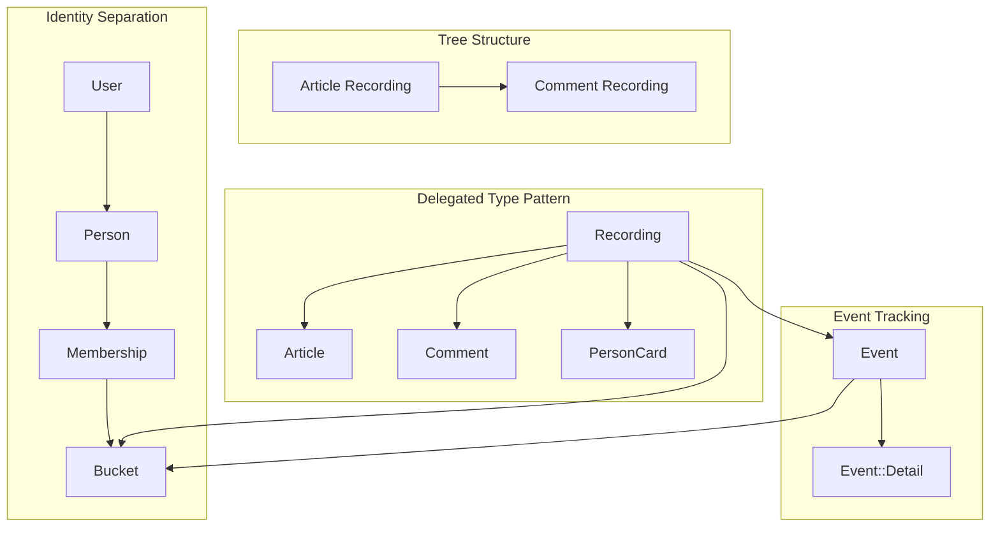

# Architecture Analysis Report

**Generated:** January 24, 2026  
**Application:** Blogger (Rails 8.1)

---

## Executive Summary

This report analyzes the architectural patterns and identifies issues in the Rails blogger application. The application implements several sophisticated patterns including delegated types for polymorphic content, immutable recordables, event sourcing-like tracking, and tree structures for hierarchical data.

**Total Issues Found:** 12 (1 invalidated)  
**Critical:** 1  
**High:** 3  
**Medium:** 4  
**Low:** 4

The most critical issue involves missing authorization enforcement, which can cause security vulnerabilities. One previously reported critical issue (duplicate `has_one :publication`) was validated as non-existent.

---

## Architecture Overview



### Core Patterns

| Pattern | Description | Key Files |
|---------|-------------|-----------|
| Recording/Recordable | Delegated type for polymorphic content | `app/models/recording.rb`, `app/models/concerns/recordable.rb` |
| Immutability | Recordables cannot be updated/deleted | `app/models/concerns/immutable.rb` |
| Event Tracking | All changes tracked via events | `app/models/concerns/eventable.rb`, `app/models/event.rb` |
| Tree Structure | Hierarchical recordings via parent_id | `app/models/concerns/tree.rb` |
| Person/User Separation | Identity vs authentication | `app/models/person.rb`, `app/models/user.rb` |
| Bucket Multi-tenancy | Content isolation via buckets | `app/models/bucket.rb`, `app/models/concerns/bucketable.rb` |
| Concern Specialization | Model-specific concern overrides | `app/models/article/`, `app/models/comment/` |

---

## Issues by Category

### Model Layer Issues

#### ~~ISSUE-001: Duplicate `has_one :publication` Declaration~~
**Severity:** ~~Critical~~  
**Status:** INVALID

~~The `has_one :publication` association is declared twice.~~

**Validation Result:** This issue does not exist. The original report incorrectly claimed that line 16 of `recording.rb` contained `has_one :publication`, but that line actually contains `delegated_type :recordable`. The association is defined only once, in the `Publisher` concern.

See `docs/validation/invalid/issue_1_duplicate_publication.md` for full validation details.

---

#### ISSUE-002: Redundant Concern Includes in Recordables
**Severity:** High  
**Status:** Confirmed

Both `Article` and `Comment` include concerns redundantly:

**Article** (`app/models/article.rb` lines 2-4):
```ruby
include Recordable
include Describable
include Searchable
```

The `Recordable` concern already includes both `Describable` and `Searchable` (`app/models/concerns/recordable.rb` lines 10-11):
```ruby
include Describable
include Searchable
```

**Comment** (`app/models/comment.rb` lines 2-6):
```ruby
include Recordable
include Broadcastable
include Countable
include Describable
include Searchable
```

The `Recordable` concern already includes `Broadcastable`, `Countable`, `Describable`, and `Searchable`.

**Impact:** While Ruby's module system handles duplicate includes gracefully, this creates maintenance confusion and violates DRY principles. The explicit includes may also interfere with the concern specialization pattern where `Article::Describable` should be resolved before `::Describable`.

**Affected Files:**
- `app/models/article.rb`
- `app/models/comment.rb`
- `app/models/concerns/recordable.rb`

**Recommended Fix:** Remove the redundant explicit includes from `Article` and `Comment`. The specialized concerns (e.g., `Article::Describable`) will be resolved correctly through Ruby's constant lookup.

---

#### ISSUE-003: Method Name Mismatch in Broadcast Pattern
**Severity:** High  
**Status:** Confirmed

The `Broadcaster` concern calls `broadcast_on_discard` but `Comment::Broadcastable` defines `broadcast_on_destroy`:

**Broadcaster** (`app/models/concerns/broadcaster.rb` line 17):
```ruby
def broadcast_recordable_discard
  recordable.broadcast_on_discard(self) if recordable.broadcastable?
end
```

**Comment::Broadcastable** (`app/models/comment/broadcastable.rb` line 19):
```ruby
def broadcast_on_destroy(recording)
  Turbo::StreamsChannel.broadcast_remove_to(...)
end
```

**Impact:** When a comment is discarded, `broadcast_on_discard` is called but the method doesn't exist. The `broadcast_on_destroy` method is never invoked.

**Affected Files:**
- `app/models/concerns/broadcaster.rb`
- `app/models/concerns/broadcastable.rb`
- `app/models/comment/broadcastable.rb`

**Recommended Fix:** Rename `broadcast_on_destroy` to `broadcast_on_discard` in `Comment::Broadcastable`, or update the base `Broadcastable` concern to define the correct method name.

---

### Controller Layer Issues

#### ISSUE-004: Missing Authorization Enforcement
**Severity:** Critical  
**Status:** Confirmed

Controllers don't enforce authorization despite the existence of `Permissible` concern with `editable_by?`, `deletable_by?`, and `viewable_by?` methods.

**PublicationsController** (`app/controllers/publications_controller.rb`):
- `create` action publishes without checking if user can publish
- `destroy` action unpublishes without permission check

**ArticlesController** (`app/controllers/articles_controller.rb`):
- `update` and `destroy` actions don't verify permissions
- Only `allow_unauthenticated_access` is used for read access

**CommentsController** (`app/controllers/comments_controller.rb`):
- `destroy` action doesn't check if user can delete the comment

**Impact:** Any authenticated user can modify or delete any content, regardless of bucket membership or role.

**Affected Files:**
- `app/controllers/publications_controller.rb`
- `app/controllers/articles_controller.rb`
- `app/controllers/comments_controller.rb`

**Recommended Fix:** Add authorization checks using the `Permissible` methods:
```ruby
def update
  authorize_action!(:editable_by?)
  # ...
end

private

def authorize_action!(permission_method)
  unless @recording.send(permission_method, Current.person)
    redirect_to root_path, alert: "Not authorized"
  end
end
```

---

#### ISSUE-005: Hardcoded Authentication Bypass
**Severity:** Medium  
**Status:** Confirmed

The `ApplicationController` has a TODO comment and hardcodes the first person/bucket:

**ApplicationController** (`app/controllers/application_controller.rb` lines 13-17):
```ruby
def set_current_person
  # TODO: Replace with current_user.person when authentication is added
  Current.person = Person.first
  Current.bucket = Bucket.first
end
```

**Impact:** 
- All requests appear to come from the first person
- Multi-tenancy is broken (all requests use first bucket)
- Authentication concern exists but isn't integrated

**Affected Files:**
- `app/controllers/application_controller.rb`
- `app/controllers/concerns/authentication.rb`

**Recommended Fix:** Integrate with the existing `Authentication` concern:
```ruby
def set_current_person
  Current.person = current_user&.person
  Current.bucket = params[:bucket_id] ? Bucket.find(params[:bucket_id]) : Current.person&.buckets&.first
end
```

---

### Concern Design Issues

#### ISSUE-006: Child Recordings Don't Inherit Bucket
**Severity:** High  
**Status:** Confirmed

The `Bucketable` concern only sets bucket from `Current.bucket`, not from parent:

**Bucketable** (`app/models/concerns/bucketable.rb` lines 10-17):
```ruby
def set_bucket_from_current
  return if bucket.present?
  raise "Current.bucket must be set" unless Current.bucket
  self.bucket = Current.bucket
end
```

**CommentsController** (`app/controllers/comments_controller.rb` lines 6-8):
```ruby
@comment_recording = @parent_recording.children.build(
  recordable: Comment.new(comment_params)
)
```

**Impact:** If `Current.bucket` differs from the parent's bucket (e.g., due to a bug or race condition), child recordings could end up in wrong buckets, breaking the tree hierarchy's bucket consistency.

**Affected Files:**
- `app/models/concerns/bucketable.rb`
- `app/controllers/comments_controller.rb`

**Recommended Fix:** Inherit bucket from parent when present:
```ruby
def set_bucket_from_current
  return if bucket.present?
  
  if parent&.bucket
    self.bucket = parent.bucket
  elsif Current.bucket
    self.bucket = Current.bucket
  else
    raise "Bucket must be set via parent or Current.bucket"
  end
end
```

---

#### ISSUE-007: Counter Concern Includes Discardable Redundantly
**Severity:** Low  
**Status:** Confirmed

**Counter** (`app/models/concerns/counter.rb` line 4):
```ruby
include ::Discardable
```

**Recording** (`app/models/recording.rb` lines 3-4):
```ruby
include Bucketable
include Discardable
```

Since `Recording` already includes `Discardable` directly, and `Counter` is only included by `Recording`, this is redundant.

**Affected Files:**
- `app/models/concerns/counter.rb`
- `app/models/recording.rb`

**Recommended Fix:** Remove `include ::Discardable` from `Counter` concern, or document why it's needed (e.g., for standalone testing).

---

#### ISSUE-008: Tree Recursion Causes N+1 Queries
**Severity:** Medium  
**Status:** Confirmed

**Tree** (`app/models/concerns/tree.rb` lines 17-27):
```ruby
def root
  root? ? self : parent.root
end

def ancestors
  return [] if root?
  [ parent ] + parent.ancestors
end

def descendants
  children.flat_map { |child| [ child ] + child.descendants }
end
```

**Impact:** 
- `root` makes N queries for N-deep trees
- `ancestors` makes N queries
- `descendants` makes 2^N queries in worst case (wide trees)

**Affected Files:**
- `app/models/concerns/tree.rb`

**Recommended Fix:** Use recursive CTEs for PostgreSQL:
```ruby
def ancestors
  Recording.find_by_sql([<<~SQL, id])
    WITH RECURSIVE tree AS (
      SELECT * FROM recordings WHERE id = ?
      UNION ALL
      SELECT r.* FROM recordings r
      JOIN tree t ON r.id = t.parent_id
    )
    SELECT * FROM tree WHERE id != ?
  SQL
end
```

---

### Database/Schema Issues

#### ISSUE-009: Orphaned Tags Table
**Severity:** Medium  
**Status:** Confirmed

The schema includes a `tags` table (`db/schema.rb` lines 130-135):
```ruby
create_table "tags", force: :cascade do |t|
  t.datetime "created_at", null: false
  t.string "name", null: false
  t.datetime "updated_at", null: false
  t.index ["name"], name: "index_tags_on_name", unique: true
end
```

However, there is no corresponding `Tag` model in `app/models/`.

**Impact:** Dead code in schema; potential confusion about feature completeness.

**Affected Files:**
- `db/schema.rb`

**Recommended Fix:** Either create the `Tag` model and integrate it, or create a migration to drop the unused table.

---

#### ISSUE-010: Publication Doesn't Follow State-as-Recordable Pattern
**Severity:** Medium  
**Status:** Confirmed

The documented pattern in `.cursor/rules/models.mdc` states:
> Represent state changes as child recordings, NOT as fields on the parent model.

However, `Publication` is a separate model with `belongs_to :recording`:

**Publication** (`app/models/publication.rb`):
```ruby
class Publication < ApplicationRecord
  belongs_to :recording
end
```

This deviates from the documented pattern of creating state recordables as children in the recording tree (e.g., `Article::Published`).

**Affected Files:**
- `app/models/publication.rb`
- `app/models/concerns/publisher.rb`
- `.cursor/rules/models.mdc`

**Recommended Fix:** Either:
1. Update the guidelines to document `Publication` as an intentional exception
2. Refactor to use the state-as-recordable pattern with `Article::Published`

---

#### ISSUE-011: Search Index Destroy/Recreate Pattern
**Severity:** Low  
**Status:** Confirmed

**Searcher** (`app/models/concerns/searcher.rb` lines 25-30):
```ruby
def update_search_index
  search_index&.destroy
  create_search_index!(
    recordable_type: recordable_type,
    content: recordable.searchable_content
  )
end
```

**Impact:** Two database operations instead of one; potential race condition window.

**Affected Files:**
- `app/models/concerns/searcher.rb`

**Recommended Fix:** Use upsert pattern:
```ruby
def update_search_index
  SearchIndex.upsert(
    { recording_id: id, recordable_type: recordable_type, content: recordable.searchable_content },
    unique_by: :recording_id
  )
  reload_search_index
end
```

---

### Missing Functionality

#### ISSUE-012: Events Lack Immutability Enforcement
**Severity:** Low  
**Status:** Minor

The `events` table only has `created_at` (no `updated_at`), suggesting immutability intent, but the `Event` model doesn't include the `Immutable` concern.

**Affected Files:**
- `app/models/event.rb`
- `db/schema.rb`

**Recommended Fix:** Add `include Immutable` to `Event` model if events should never be modified.

---

#### ISSUE-013: Orphan Recordables Accumulate
**Severity:** Low  
**Status:** Potential

Due to immutability, old recordable rows remain in the database when recordings are updated. No cleanup mechanism exists.

**Impact:** Gradual database bloat from orphaned `articles` and `comments` rows.

**Affected Files:**
- `app/models/concerns/immutable.rb`

**Recommended Fix:** Implement a background job to periodically clean up orphaned recordables, or accept this as intentional for audit purposes.

---

## Summary Table

| ID | Issue | Severity | Category |
|----|-------|----------|----------|
| ~~ISSUE-001~~ | ~~Duplicate `has_one :publication`~~ | ~~Critical~~ | ~~Model~~ (INVALID) |
| ISSUE-002 | Redundant concern includes | High | Model |
| ISSUE-003 | Broadcast method name mismatch | High | Concern |
| ISSUE-004 | Missing authorization | Critical | Controller |
| ISSUE-005 | Hardcoded auth bypass | Medium | Controller |
| ISSUE-006 | Child bucket inheritance | High | Concern |
| ISSUE-007 | Counter includes Discardable | Low | Concern |
| ISSUE-008 | Tree recursion N+1 | Medium | Concern |
| ISSUE-009 | Orphaned tags table | Medium | Schema |
| ISSUE-010 | Publication pattern deviation | Medium | Schema |
| ISSUE-011 | Search index destroy/recreate | Low | Concern |
| ISSUE-012 | Events lack immutability | Low | Model |
| ISSUE-013 | Orphan recordables accumulate | Low | Model |

---

## Next Steps

1. Address Critical issue (ISSUE-004: Missing authorization) immediately
2. Address High severity issues in next sprint
3. Schedule Medium severity issues for technical debt backlog
4. Document Low severity issues as known limitations or future improvements
